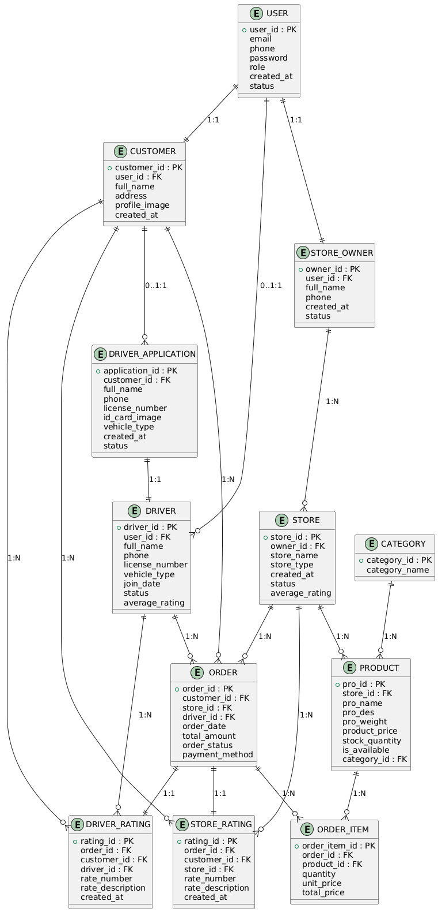
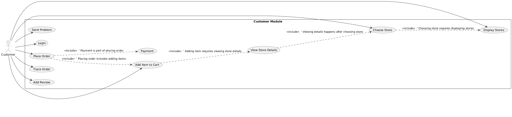
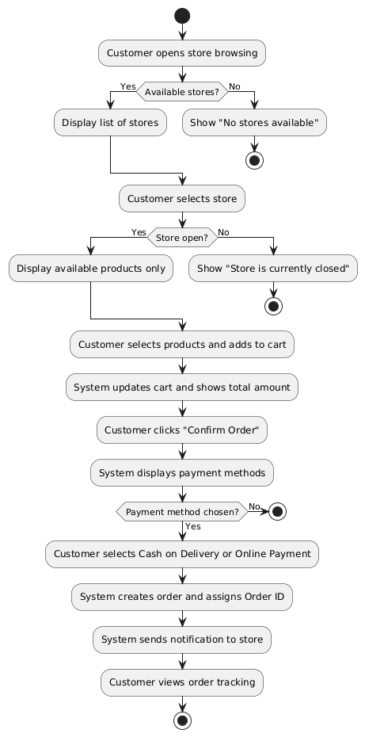
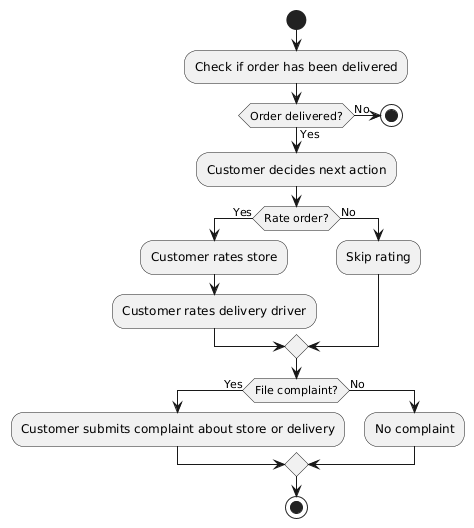

# Village Unified Delivery & Marketplace System (VUDMS)

---

## ✅ Vision
The system aims to solve communication and service accessibility issues faced by village residents, where customers traditionally contact supermarkets, restaurants, and pharmacies by phone in a manual and inefficient way. Customers are often unaware of all available stores or newly opened shops, limiting visibility and making ordering difficult. Store owners currently manage inventory manually using paper-based methods.

The platform provides a unified digital environment for all supermarkets, restaurants, pharmacies, and essential services within the village. Customers can browse stores, view menus/products, place orders, track order status end-to-end, and pay seamlessly. Store owners get a dedicated interface to manage inventory digitally and maintain accurate stock levels.

The platform also includes a delivery job application page for village residents, ensuring that all drivers are from within the village for trust and safety. Customers can rate both stores and delivery drivers, improving service quality and transparency.

---

## ✅ Functional Requirements

### **1. Customer Module**

#### **1.1 Registration & Login**
- Create a new account using phone number or email.
- Log in to their account.

#### **1.2 Browsing Stores & Services**
- View all supermarkets, restaurants, pharmacies, and services in the village.
- See store details (address, working hours, contact info, menu/products).
- See newly added stores immediately.

#### **1.3 Placing Orders**
- Add items to cart.
- Complete order fully through the system.
- View total cost and estimated delivery time.

#### **1.4 Order Tracking**
- Track order status in real time: Pending Review, Preparing, Picked by Delivery, On the Way, Delivered, Paid.
- Receive notifications for status updates.

#### **1.5 Payments**
- Pay cash on delivery or via online payment (if available).

#### **1.6 Reviews & Ratings**
- Rate store/restaurant and delivery driver.
- Ratings are visible for quality improvement.

---

### **2. Store Owner Module**

### **2.1 Store Management**

- The store owner must be able to create a store account and enter store details.
    
- The owner must be able to update store information (name, address, working hours, etc.).
    

### **2.2 Product/Menu Management**

- The owner must be able to add products or meals.
    
- The owner must be able to edit prices and quantities.
    
- The owner must be able to delete products.
    

### **2.3 Inventory Management**

- The system must automatically reduce stock after each order.
    
- The owner must receive a low-stock alert.
    

### **2.4 Order Handling**

- The owner must view all incoming orders.
    
- The owner must be able to update order status (Preparing – Ready – Completed).
    
- Notifications must be sent to the customer after each status change.
    

---

## **3. Delivery Module**

### **3.1 Delivery Job Application**

- The system must include a delivery job application page.
    
- The applicant must upload an ID card photo.
    
- The applicant must be from the same village (security requirement).
    

### **3.2 Delivery Assignment**

- The delivery driver must see available delivery orders.
    
- The driver must accept an order and deliver it.
    
- The driver must update the order status:
    
    - “Order Picked”
        
    - “Delivered”
        

---

## **4. Admin Module**

### **4.1 Approvals**

- The admin must review and approve new stores.
    
- The admin must review and approve delivery driver applications.
    

### **4.2 Monitoring**

- The admin must be able to view all stores, customers, and drivers.
    
- The admin must monitor store and driver ratings.
    

---

# ✅ **Non Functional Requirements**

- The system must be available 24/7.
- The system must provide real-time order status updates.
- The system must have a simple user interface that works for non-technical users
-  The system must load store listings within 3 seconds.
- The system must ensure all store data is displayed accurately.
-  The system must verify delivery applicants’ identity securely.
- Admin must approve delivery applicants before activation.
- The system must be scalable to support adding new stores, supermarkets, restaurants, and pharmacies without requiring major architectural changes

----

## ✅Constraints

        
- **Availability & Maintenance Constraint**
    
    - The system must not be unavailable for more than 1 hour per month.
        
    - All system updates and additions must occur during scheduled maintenance windows.

- **Delivery Staff Constraint**
    
    - All delivery agents must be residents of the same village.
        
    - Each delivery agent must be approved by the admin before being active in the system.
        
- **Store Approval Constraint**
    
    - Every new store must be reviewed and approved by the admin before it becomes visible to customers.
        
- **Data Privacy Constraint**
    
    - Customer data must be protected according to the privacy policy.

    
- Quality & Reputation Constraint – Delivery System**

     - Any store or delivery agent whose 1-star ratings reach **10% or more of total received ratings and at least 30 ratings** must be reviewed by the admin.
    
    - The system must automatically notify the admin when this threshold is reached.
    
     - After review, the admin can decide whether to deactivate the store or delivery agent temporarily or permanently.
    
    - This ensures that consistently low-quality services are removed, maintaining reliability and trust for customer

## System Actors

- **Customer** — Represents any user who browses stores, views products, places orders, tracks delivery status, makes payments, and submits reviews.

- **Store Owners** — A business owner who manages a store on the system. Responsibilities include adding store details, managing products/menu, updating inventory, handling incoming orders, and tracking customer ratings

- **Delivery Drivers** —A delivery agent responsible for delivering customer orders.  They can apply for a delivery job, upload required documents, accept delivery tasks, update order delivery status, and receive ratings from customers.

- **Admin** — A system administrator responsible for reviewing and approving new stores and delivery drivers, monitoring system activities, managing platform data, handling reports or complaints, and ensuring overall system quality.

---

## ERD

  
   
  <em>Diagram showing the main entities in the VUDMS system and the relationships between them, including Customers, Stores, Products, Orders, Delivery Drivers, and Admin.</em>

---

## ⭐ Use Case : Customer Places Order

  
   
  <em>Use Case Diagram showing the steps a customer takes to place an order, from browsing stores to completing payment.</em>

**Actor:** Customer  
**Goal:** Customer completes an order from product selection to payment.  
**Preconditions:** Customer is logged in; stores are displayed; products are in stock.  
**Postconditions:** Customer order is created, notification sent to store, order progresses to "Pending Review".

### Main Flow
1. Customer opens store browsing interface.
2. System displays stores categorized by type (Restaurants – Supermarkets – Pharmacies).
3. Customer selects a store.
4. System displays store details (Menu, Prices, Ratings, Stock).
5. Customer selects products and adds to cart.
6. System updates cart and shows total amount.
7. Customer confirms order.
8. Customer selects payment method (Cash on Delivery / Online Payment).
9. System creates order, assigns Order ID, sends notification to store.
10. Customer can view order tracking status.

---

## ⭐ Flow Diagrams

### Flow Diagram: Customer Makes an Order

  
   
  <em>Flowchart showing the step-by-step process a customer follows to place an order.</em>

### Flow Diagram: Customer Rates an Order or Makes a Complaint

  
   
  <em>Flowchart showing the steps for rating an order or submitting a complaint.</em>

